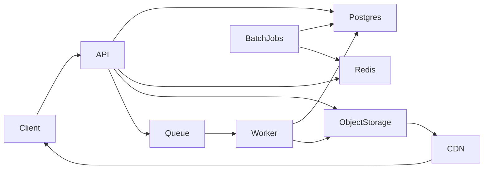

# Rust Backend Plan

## Architecture and framework choice

- **Framework**: `axum` (Tokio + Tower ecosystem). It’s ergonomic, high-performance, async-first, and integrates cleanly with middleware, tracing, and service composition. It’s easier to maintain long-term than more specialized stacks and aligns with best‑practice Rust web patterns.
- **Style**: modular monolith with strict boundaries (domain → application → infrastructure). This keeps the initial footprint small while allowing clean extraction of services later without rewriting core logic.
- **Data flow**: synchronous API for reads/writes + asynchronous job pipeline for media processing and notifications.

## Scaling strategy and evolution path

- **Start cheap, keep the shape**: one API instance + one worker process is enough early on, but the same queue-driven boundaries scale to multiple API instances and many workers later.
- **Follower cap impact**: max follower counts in the low thousands reduces worst‑case fan‑out, but bursty activity still benefits from async jobs and controlled backfills.
- **Scale without rewrites**: keep a single codebase with separate processes (API, worker, batch) so horizontal scaling does not require architectural changes.

## Initial Scaleway footprint (lowest cost without future lock‑in)

- Compute: 1–2 small instances for API + worker (same binary, separate processes)
- DB: managed PostgreSQL (start with smallest viable tier)
- Object storage: Scaleway Object Storage (One‑Zone if acceptable)
- CDN: Scaleway Edge Services (Starter/Pro) in front of object storage
- Cache: Redis (can be self‑hosted on instance at first, move to managed later)
- Queue: SQS‑compatible (Scaleway Messaging)

## Core modules and boundaries (to avoid rearchitecture)

- **Auth & Accounts**: user, sessions/tokens, profile
- **Social Graph**: follow/unfollow, block
- **Content**: posts, media metadata, visibility
- **Engagement**: likes, comments
- **Feed**: timeline queries + cache strategy (fan‑out on read; optional precompute later)
- **Media pipeline**: upload → store → enqueue → process variants → update metadata
- **Notifications**: async via queue (can be a no‑op initially)

## Event‑driven and batch workflows

- **Media pipeline** (event‑driven): upload → store → enqueue → process variants → update metadata.
- **Notifications** (event‑driven): enqueue on likes/comments/follows; workers send later.
- **Feed hydration** (event‑driven): optional timeline precompute for hot users or peak hours.
- **Batch jobs** (interval): recalc counters, repair denormalized fields, cleanup expired tokens, and backfill feed snapshots in a rate‑limited way.

## Feed strategy at scale

- **Phase 1**: fan‑out on read with aggressive caching and pagination.
- **Phase 2**: hybrid model for hot users and busy periods (precompute recent items into Redis/Postgres tables).
- **Trigger points**: queue depth growth, high API latency on feed endpoints, or hot users exceeding cache hit targets.

## Phase 2 (future)

- Add a background feed builder to precompute timelines for hot users.
- Introduce rate‑limited backfills to smooth traffic spikes during peaks.

## Endpoint catalog and service mapping

All list endpoints use cursor pagination (`limit` + `cursor`) and return `next_cursor`.

**Auth**
- `POST /auth/token` → `AuthService::create_token` → DB
- `POST /auth/revoke` → `AuthService::revoke_token` → DB
- `GET /auth/me` → `AuthService::get_current_user` → DB

**Users & profiles**
- `POST /users` → `UserService::create_user` → DB
- `GET /users/:id` → `UserService::get_user` → DB
- `PATCH /users/:id` → `UserService::update_profile` → DB, S3 (avatar)
- `GET /users/:id/posts` → `PostService::list_by_user` → DB

**Social graph**
- `POST /users/:id/follow` → `SocialService::follow` → DB, Queue (notify)
- `POST /users/:id/unfollow` → `SocialService::unfollow` → DB
- `POST /users/:id/block` → `SocialService::block` → DB
- `POST /users/:id/unblock` → `SocialService::unblock` → DB
- `GET /users/:id/followers` → `SocialService::list_followers` → DB
- `GET /users/:id/following` → `SocialService::list_following` → DB
- `GET /users/:id/relationship` → `SocialService::relationship_status` → DB

**Posts**
- `POST /posts` → `PostService::create_post` → DB, Queue (notify)
- `GET /posts/:id` → `PostService::get_post` → DB
- `PATCH /posts/:id` → `PostService::update_caption` → DB
- `DELETE /posts/:id` → `PostService::delete_post` → DB

**Engagement**
- `POST /posts/:id/like` → `EngagementService::like_post` → DB, Queue (notify)
- `DELETE /posts/:id/like` → `EngagementService::unlike_post` → DB
- `GET /posts/:id/likes` → `EngagementService::list_likes` → DB
- `POST /posts/:id/comment` → `EngagementService::comment_post` → DB, Queue (notify)
- `GET /posts/:id/comments` → `EngagementService::list_comments` → DB
- `DELETE /posts/:id/comments/:comment_id` → `EngagementService::delete_comment` → DB

**Feed**
- `GET /feed` → `FeedService::get_home_feed` → DB, Redis
- `POST /feed/refresh` → `FeedService::refresh_home_feed` → DB, Redis

**Media**
- `POST /media/upload` → `MediaService::create_upload` → DB, S3
- `POST /media/upload/:id/complete` → `MediaService::complete_upload` → DB, Queue
- `GET /media/:id` → `MediaService::get_media` → DB
- `GET /media/upload/:id/status` → `MediaService::get_upload_status` → DB
- `DELETE /media/:id` → `MediaService::delete_media` → DB, S3

**Notifications**
- `GET /notifications` → `NotificationService::list` → DB
- `POST /notifications/:id/read` → `NotificationService::mark_read` → DB

**Moderation/Admin**
- `POST /moderation/users/:id/flag` → `ModerationService::flag_user` → DB
- `POST /moderation/posts/:id/takedown` → `ModerationService::takedown_post` → DB
- `POST /moderation/comments/:id/takedown` → `ModerationService::takedown_comment` → DB
- `GET /moderation/audit` → `ModerationService::list_audit` → DB

**Search/Discovery**
- `GET /search/users` → `SearchService::search_users` → DB (handle/display name indexes)
- `GET /search/posts` → `SearchService::search_posts` → DB (caption/hashtags index; optional external search later)

## Data model additions (future)

- `notifications` table (user_id, type, payload, read_at, created_at)
- `moderation_actions` table (actor_id, target_type, target_id, reason, created_at)
- `user_flags` table (reporter_id, target_id, reason, created_at)
- `feed_cache` table (optional, Phase 2 hybrid precompute)

## Indexing and performance notes

- Add indexes for search: `users(handle)`, `users(display_name)`, `posts(caption)`; consider trigram indexes later.
- Add composite indexes for list endpoints: `comments(post_id, created_at DESC)`, `likes(post_id, created_at DESC)`.

## Data and storage modeling approach

- PostgreSQL schema optimized for feed queries and graph edges
- Object storage holds originals + derived variants (thumb/medium)
- CDN caches variants; API never proxies binary media
- IDs: ULID/UUID for time‑sortable keys
- Counters: cached aggregates with periodic batch recomputation for consistency

## Observability and ops baseline

- Structured logging + tracing spans in all request paths
- Metrics endpoints (latency, DB time, cache hit rate)
- Background job visibility (queue depth, failure counts)

## High‑level design diagram

## Key files to create (initial scaffolding)

- `src/main.rs` (startup, routers, middleware)
- `src/config/mod.rs` (env config)
- `src/http/` (routes, handlers, request/response types)
- `src/domain/` (entities + domain logic)
- `src/app/` (use cases/services)
- `src/infra/` (db, cache, storage, queue clients)
- `src/jobs/` (background workers)
- `migrations/` (SQL migrations)

## Testing approach

- Unit tests for domain logic
- Integration tests for DB queries
- Minimal API tests for main flows (sign‑up, post, follow, feed)
